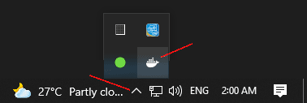
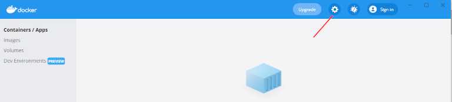
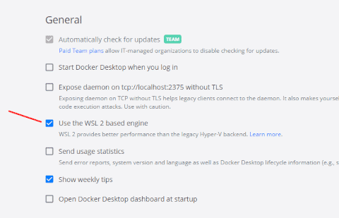
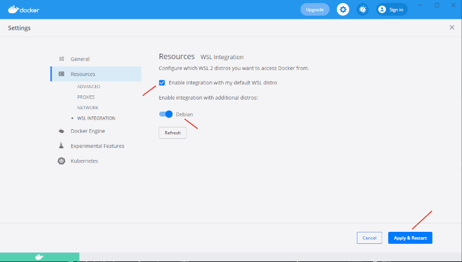
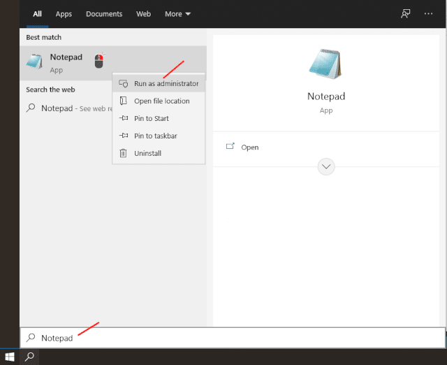
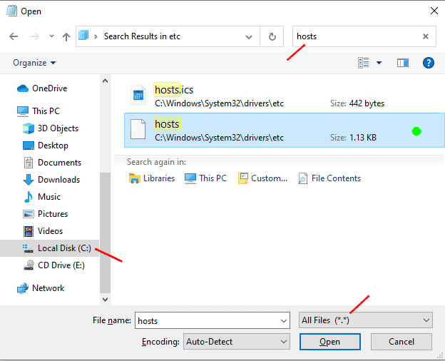

                  _     _
    __      _____| | __| |
    \ \ /\ / / _ \ |/ _` |
     \ V  V /  __/ | (_| |
      \_/\_/ \___|_|\__,_|


**weld** is an automated WordPress Local Development Environment using Docker. It streamlines team collaboration by ensuring everyone shares the same development environment and uses consistent software versions.

## Table of contents

- [Prerequisites](#prerequisites)
    - [└─ Configuring Docker to use WSL2 based engine on Windows](#installing-docker--windows)
    - [└─ Rootless Docker in Linux](#rootless-docker)
- [Setting up a new project](#project-setup)
    - [└─ Environment Variables](#environment-variables)
    - [└─ The `weld` CLI](#the-weld-cli)
    - [└─ Modifying the system's `hosts` file](#modifying-hosts)
- [Logging](#container-logs)

&nbsp;
&nbsp;

## Prerequisites

Prior to running **weld**, make sure to install the required dependencies. Ensure the following software is both installed and accessible on your machine:

- Docker (with WSL2 if you are a Windows user)
- Docker Compose

&nbsp;

**└─ Configuring Docker to use WSL2 based engine on Windows.**
<a class="anchor" name="installing-docker--windows"></a>

Enable WSL2 backend in Docker by following these steps:
1. Open the Docker app at the bottom right corner of `Windows Taskbar`.

    

2. Go to `Settings` at the top right corner of Docker app.

    

3. In the opened window enable `Use the WSL 2 based engine` option.

    

4. Next, go to `Resources -> WSL INTEGRATION` in the same window and enable these two options:
    - Enable integration with my default WSL distro
    - Enable integration with additional distros: \<distro_name\> (in my case, Debian)

    Then, click `Apply & Restart` button.

    

&nbsp;

**└─ Rootless Docker in Linux**
<a class="anchor" name="rootless-docker"></a>

Rootless mode allows running the Docker daemon and containers as a non-root user to mitigate potential vulnerabilities in the daemon and the container runtime. Starting from Docker Engine v20.10 this is the recommended way of running Docker in Linux.

To configure Rootless mode on your Linux distribution, please see [the official Docker documentation](https://docs.docker.com/engine/security/rootless/).

&nbsp;
&nbsp;

## Setting up a new project
<a class="anchor" name="project-setup"></a>
Clone this repository to any directory your user has access to.

```bash
git clone https://github.com/oorkan/weld
```

⚠️ For MacOS users, it is **strongly recommended** to setup your local environment inside of an [APFS (Case-sensitive)](TROUBLESHOOTING.md#database-imports-mac-grpc-fuse) disk volume.

⚠️ Under Windows, you should clone this repository inside your Linux subsystem.

To start setting up a new project, first, set up some environment variables. Simply copy the `.env.example` file and rename it to `.env` to get started with the variables:

```bash
cp .env.example .env
```

&nbsp;

**└─ Environment variables**
<a class="anchor" name="environment-variables"></a>
---

In the .env file, you don't have to alter variables with predefined values.

⚠️ **DO NOT MODIFY** the values of the following variables at all; they are marked with `DO NOT MODIFY!` in the file:

- `WORDPRESS_DB_HOST`
- `WORDPRESS_DB_USER`
- `WORDPRESS_DB_PASSWORD`
- `WORDPRESS_DB_NAME`
- `DOMAIN_CURRENT_SITE`

⚠️ **MAKE SURE** that passwords or any sensitive values in the `.env` file never match those used in the project servers, including staging servers.

&nbsp;

The values for `MYSQL_ROOT_PASSWORD` and `MYSQL_PASSWORD` must:
- ✅ Be either set without quotes or set with single quotes.
- ✅ Be long and robust enough (20+ characters, including numbers, uppercase letters, lowercase letters, and special characters).

The values for `MYSQL_ROOT_PASSWORD` and `MYSQL_PASSWORD` must not:
- ❌ Contain spaces or line breaks.
- ❌ Contain the ^ special character.

You can generate strong MySQL passwords using the following tool: https://bitwarden.com/password-generator/.

The values for WordPress salts, including WP_AUTH_KEY, WP_SECURE_AUTH_KEY, WP_LOGGED_IN_KEY, etc., should:
- ✅ Be set with single or double quotes (preferably single quotes).
- ✅ Be long and robust enough (50+ characters, including numbers, uppercase letters, lowercase letters, and special characters).

You have two options for generating your own salts:
- Visit https://api.wordpress.org/secret-key/1.1/salt/ (refresh the page to get a new set of salts)
- Run the following command in your terminal:

    ```bash
    ./weld generate-wp-salts
    ```

    And copy the salts from the newly generated `wp.salts` file.

The value of `LOCAL_DOMAIN` must:
- ✅ Match the project's local development environment domain name

Example:
```text
LOCAL_DOMAIN=myawesomesite.local
```

You're all set to proceed with the project setup. Please check out the next section.

&nbsp;

**└─ The `weld` CLI**
<a class="anchor" name="the-weld-cli"></a>
---

**weld** provides a command-line interface to simplify project setup and make working in the local development environment more comfortable.

First, make sure the file called `weld` is executable. To do that run the following command in your terminal:

```bash
chmod +x weld
```

If you've set all the environment variables, then run the following command to set up a new project:
```bash
./weld setup
```

It'll handle all the necessary tasks. You'll find the project files installed in your working directory, typically named `app` by default.

If you have an existing project you want to run, follow these steps:

1. Copy and overwrite the existing files in the `app` directory with your project files.
2. Import the SQL dump of your project's database:

    ```bash
    ./weld db import </absolute/path/to/db-export.sql>
    ```

    🟨 **Note:** After executing `./weld setup`, MySQL requires some time to start and become ready for connections. Occasionally (but rarely), `./weld db import` may not work the first time due to this delay. To verify if the database is ready for importing, run:

    ```bash
    ./weld db ready
    ```

    It should return "Ready for connections" on success.
3. If something goes wrong during the database import, you can wipe the database and try again after fixing the issues. To wipe the database, run:

    ```bash
    ./weld db wipe
    ```

&nbsp;

You're nearly there! The final step is to adjust your system's **hosts** file. Please refer to the next section for guidance.

&nbsp;

**└─ Modifying the system's hosts file**
<a class="anchor" name="modifying-hosts"></a>
---

After the ./weld setup process is completed, you should locate a file named "hosts" in the same directory. Copy its contents and paste them into your system's hosts file.

- For MacOS/Linux, the system's hosts file is located at `/etc/hosts`.
- For Windows, the system's hosts file is usually found at `C:\Windows\System32\drivers\etc`. To edit it:
    1. Right click on Notepad program and open it as administrator.

        

    2. In Notepad, go to `File > Open...`

    3. In the opened window, confirm that you've chosen `drive C` and set the search filter to `All Files (*.*)`. Then, look for the file named *hosts*.

        

    4. Open the system's hosts file, make the edits and save it.

&nbsp;

If everything is set up correctly, you're all set to view the project in your web browser. Simply navigate to the project's local domain address, which can be found in your **.env** file under the `LOCAL_DOMAIN` environment variable. 😊

&nbsp;
&nbsp;

## Logging
<a class="anchor" name="container-logs"></a>

**TL;DR**

```bash
# detailed log | search keyword(s)
docker logs --details <docker_container_name> | grep "<keyword(s)>"
```

```bash
# detailed log | realtime
docker logs --details -f <docker_container_name>
```

```bash
# write to file | realtime (always adding new logs to the file)
docker logs --details -f <docker_container_name> > <logfile> 2>&1 &
```

Example:

```bash
docker logs --details -f docker-wp > error.log 2>&1 &
```

⚠️ Be cautious about continually adding new logs to your log file, as it will consistently increase in size over time. It's a good idea to periodically empty it.

&nbsp;

You can find more information about logging in Docker in [the official documentation](https://docs.docker.com/engine/reference/commandline/logs/).

&nbsp;
&nbsp;
